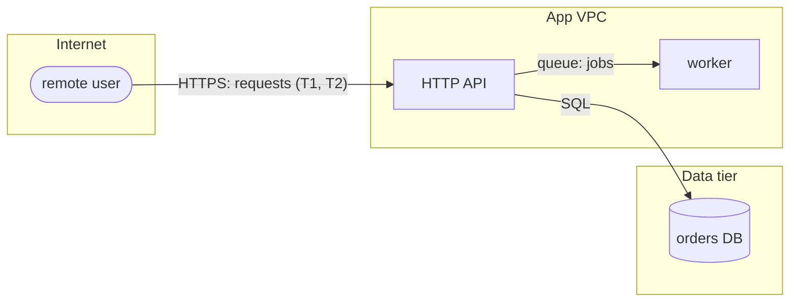

# Diagramming data flows

Output: one fenced `mermaid` block for section 9 (or a standalone `DFD.mmd`).

## Conventions

- `flowchart LR`.
- Each trust zone is a `subgraph` named for the zone ("Internet", "DMZ",
  "App VPC", "Data tier", "Third party").
- External actors: `([actor])`. Processes: `[process]`. Data stores: `[(store)]`.
- Edge labels name the protocol and data: `-->|HTTPS: login creds|`.
- Every edge that crosses a subgraph is a trust boundary and must match a
  section 3 row. Every data store must match a section 2 asset.
- Annotate top threats on edges: `-->|"gRPC: orders (T3, T7)"|`.

## Example

